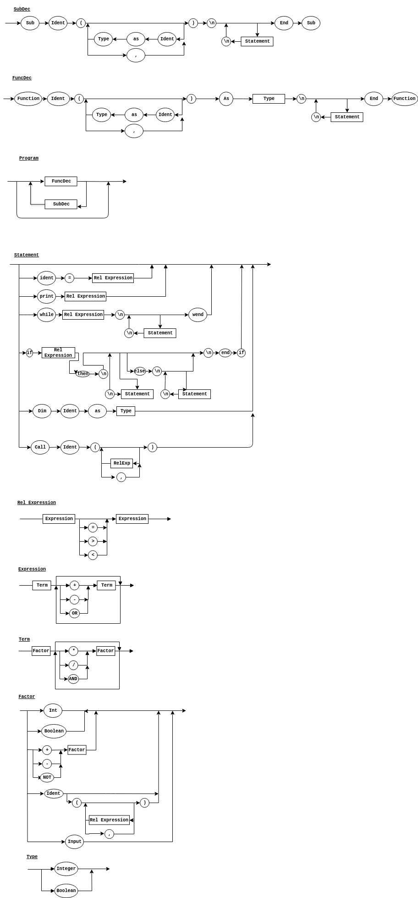

# compiler
Compilador da matéria de Lógica da Computação

## EBNF
Program = SubDec|FuncDec

SubDec = “sub”, “identifier”, “(“, { | (“identifier”, “as”, Type)}, “)”, “\n”, { | ( Statement, “\n”)}, “end”, “sub”;

FuncDec = “function”, “identifier”, “(“, { | (“identifier”, “as”, Type)}, “)”, “as”, Type, “\n”, { | ( Statement, “\n”)}, “end”, “function”;

RelExpression = Expression, {“=” | ”>” | ”<”}, Expression;

Expression = Term, {(“+” |  “-” | ”or”),Term | ;

Term = Factor, {(“*” | ”/” | ”and”), Factor} | ;

Factor = “number” | {“boolean” | (”identifier”,{| {“(“{(| RelExpression, {| “,”})}}}) | {(“+” | ”-” | ”not”), Factor} | “(“, RelExpression, “)” | ”input”;

Statement = | (“identifier”, “=”, RelExpression) | (“print”, RelExpression) | (“dim”, “identifier”, “as”, Type) | (“if”, RelExpression, “then”, “\n”, {| (Statement, “\n”), {| (“else”, “\n”, {| (Statement, “\n”)}}, “end”, “if”) | (“call”, “identifier”, “(“, {| {RelExpression, {| “,”}});

## Diagramas Sintáticos

## EBNF

Program = SubDec|FuncDec

SubDec = “sub”, “identifier”, “(“, { | (“identifier”, “as”, Type)}, “)”, “\n”, { | ( Statement, “\n”)}, “end”, “sub”;

FuncDec = “function”, “identifier”, “(“, { | (“identifier”, “as”, Type)}, “)”, “as”, Type, “\n”, { | ( Statement, “\n”)}, “end”, “function”;

RelExpression = Expression, {“=” | ”>” | ”<”}, Expression;

Expression = Term, {(“+” |  “-” | ”or”),Term | ;

Term = Factor, {(“*” | ”/” | ”and”), Factor} | ;

Factor = “number” | {“boolean” | (”identifier”,{| {“(“{(| RelExpression, {| “,”})}}}) | {(“+” | ”-” | ”not”), Factor} | “(“, RelExpression, “)” | ”input”;

<<<<<<< HEAD
Statement = | (“identifier”, “=”, RelExpression) | (“print”, RelExpression) | (“dim”, “identifier”, “as”, Type) | (“if”, RelExpression, “then”, “\n”, {| (Statement, “\n”), {| (“else”, “\n”, {| (Statement, “\n”)}}, “end”, “if”) | (“call”, “identifier”, “(“, {| {RelExpression, {| “,”}});
=======

>>>>>>> a5982ab6dddc2e2896de1e0230e6cc1f5131be20
